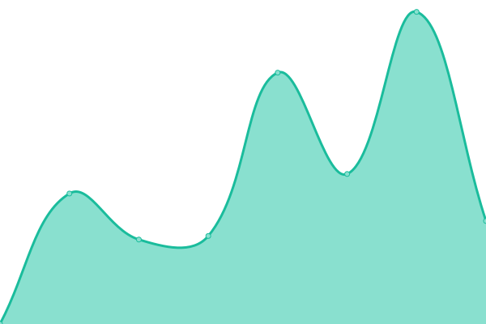

# [📈 Live Status](https://status.gegenlicht.net): <!--live status--> **🟩 All systems operational**

This repository contains the open-source uptime monitor and status page for [Unikino GEGENLICHT](https://gegenlicht.net), powered by [Upptime](https://github.com/upptime/upptime).

With [Upptime](https://upptime.js.org), you can get your own unlimited and free uptime monitor and status page, powered entirely by a GitHub repository. We use [Issues](https://github.com/unikino-gegenlicht/status-monitor/issues) as incident reports, [Actions](https://github.com/unikino-gegenlicht/status-monitor/actions) as uptime monitors, and [Pages](https://status.gegenlicht.net) for the status page.

<!--start: status pages-->
<!-- This summary is generated by Upptime (https://github.com/upptime/upptime) -->
<!-- Do not edit this manually, your changes will be overwritten -->
<!-- prettier-ignore -->
| URL | Status | History | Response Time | Uptime |
| --- | ------ | ------- | ------------- | ------ |
|  [Website](https://gegenlicht.net) | 🟩 Up | [website.yml](https://github.com/unikino-gegenlicht/status-monitor/commits/HEAD/history/website.yml) | 

 1057ms
     
 | 

<a href="https://status.gegenlicht.net/history/website">100.00%</a>
    

|  [Identity and Access Management](https://accounts.gegenlicht.net/-/health/ready/) | 🟩 Up | [identity-and-access-management.yml](https://github.com/unikino-gegenlicht/status-monitor/commits/HEAD/history/identity-and-access-management.yml) | 

 816ms
     
 | 

<a href="https://status.gegenlicht.net/history/identity-and-access-management">100.00%</a>
    

|  [Survey and Form Tool](https://forms.gegenlicht.net) | 🟩 Up | [survey-and-form-tool.yml](https://github.com/unikino-gegenlicht/status-monitor/commits/HEAD/history/survey-and-form-tool.yml) | 

 1022ms
     
 | 

<a href="https://status.gegenlicht.net/history/survey-and-form-tool">100.00%</a>
    

|  [Knowledge Base](https://wiki.gegenlicht.net) | 🟩 Up | [knowledge-base.yml](https://github.com/unikino-gegenlicht/status-monitor/commits/HEAD/history/knowledge-base.yml) | 

 1883ms
     
 | 

<a href="https://status.gegenlicht.net/history/knowledge-base">99.84%</a>
    

|  [Appointment Planner](https://terminplaner.gegenlicht.net) | 🟩 Up | [appointment-planner.yml](https://github.com/unikino-gegenlicht/status-monitor/commits/HEAD/history/appointment-planner.yml) | 

 1140ms
     
 | 

<a href="https://status.gegenlicht.net/history/appointment-planner">100.00%</a>
    

|  [Ticketing](https://tickets.gegenlicht.net) | 🟩 Up | [ticketing.yml](https://github.com/unikino-gegenlicht/status-monitor/commits/HEAD/history/ticketing.yml) | 

 686ms
     
 | 

<a href="https://status.gegenlicht.net/history/ticketing">100.00%</a>
    

|  [Mailing List Management](https://lists.gegenlicht.net) | 🟩 Up | [mailing-list-management.yml](https://github.com/unikino-gegenlicht/status-monitor/commits/HEAD/history/mailing-list-management.yml) | 

 897ms
     
 | 

<a href="https://status.gegenlicht.net/history/mailing-list-management">100.00%</a>
    

|  [E-Mail Groupware](https://portal.gegenlicht.net) | 🟩 Up | [e-mail-groupware.yml](https://github.com/unikino-gegenlicht/status-monitor/commits/HEAD/history/e-mail-groupware.yml) | 

 598ms
     
 | 

<a href="https://status.gegenlicht.net/history/e-mail-groupware">100.00%</a>
    

|  [IMAP](mail.gegenlicht.net) | 🟩 Up | [imap.yml](https://github.com/unikino-gegenlicht/status-monitor/commits/HEAD/history/imap.yml) | 

 133ms
     
 | 

<a href="https://status.gegenlicht.net/history/imap">100.00%</a>
    

|  [IMAP (TLS/SSL)](mail.gegenlicht.net) | 🟩 Up | [imap-tls-ssl.yml](https://github.com/unikino-gegenlicht/status-monitor/commits/HEAD/history/imap-tls-ssl.yml) | 

 132ms
     
 | 

<a href="https://status.gegenlicht.net/history/imap-tls-ssl">100.00%</a>
    

|  [SMTP](mail.gegenlicht.net) | 🟩 Up | [smtp.yml](https://github.com/unikino-gegenlicht/status-monitor/commits/HEAD/history/smtp.yml) | 

 133ms
     
 | 

<a href="https://status.gegenlicht.net/history/smtp">100.00%</a>
    

|  [SMTP (explicit TLS)](mail.gegenlicht.net) | 🟩 Up | [smtp-explicit-tls.yml](https://github.com/unikino-gegenlicht/status-monitor/commits/HEAD/history/smtp-explicit-tls.yml) | 

 132ms
     
 | 

<a href="https://status.gegenlicht.net/history/smtp-explicit-tls">100.00%</a>
    

|  [SMTP (implicit SSL)](mail.gegenlicht.net) | 🟩 Up | [smtp-implicit-ssl.yml](https://github.com/unikino-gegenlicht/status-monitor/commits/HEAD/history/smtp-implicit-ssl.yml) | 

 133ms
     
 | 

<a href="https://status.gegenlicht.net/history/smtp-implicit-ssl">100.00%</a>
    

<!--end: status pages-->

[**Visit our status website →**](https://status.gegenlicht.net)

## 📄 License

- Powered by: [Upptime](https://github.com/upptime/upptime)
- Code: [MIT](./LICENSE) © [Anand Chowdhary](https://anandchowdhary.com), supported by [Pabio](https://pabio.com)
- Data in the `./history` directory: [Open Database License](https://opendatacommons.org/licenses/odbl/1-0/)
